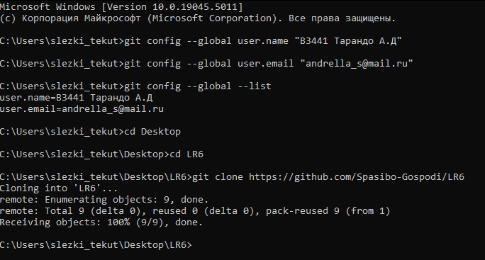
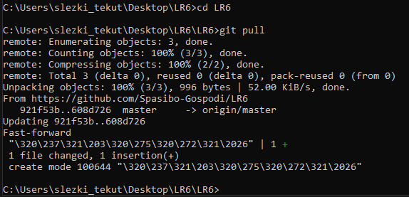
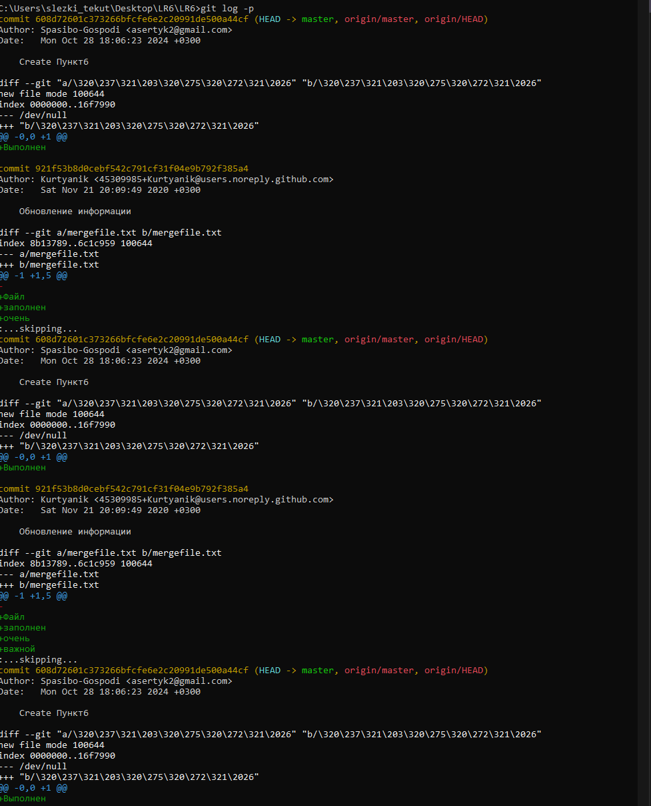
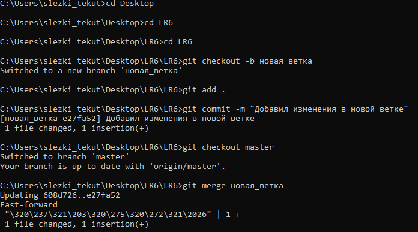
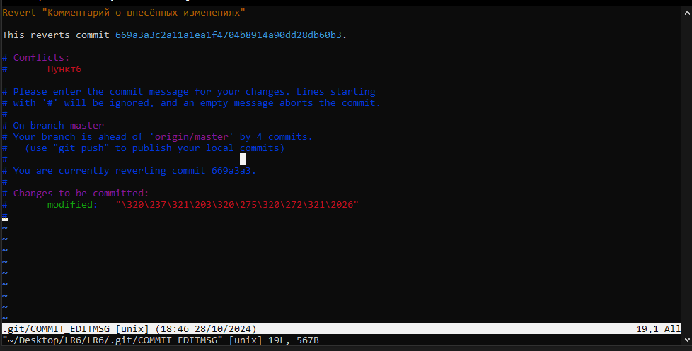
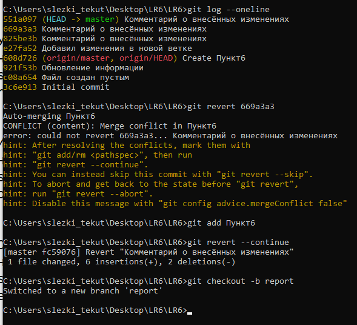

# LR6
Лабораторная работа №6


---

# Отчёт по Лабораторной работе №6
**Тема:** Система контроля версий  
**Цель:** Изучение базовых возможностей системы управления версиями, работа с Git API, локальным и удалённым репозиторием.

## 1. Создание аккаунта на GitHub
- Создан аккаунт на [GitHub](https://github.com/).

## 2. Клонирование репозитория
- Сделана копия (Fork) репозитория с исходного репозитория по адресу: [https://github.com/Kurtyanik/LR6/](https://github.com/Kurtyanik/LR6/).

## 3. Установка Git
- Установлен Git с официального сайта: [https://git-scm.com/](https://git-scm.com/).
  
## 4. Настройка Git
- Настроен Git, добавлено имя пользователя и email:
  ```bash
  git config --global user.name "В3441 Тарандо А.Д."
  git config --global user.email "andrella_s@mail.ru"
  ```

## 5. Клонирование удалённого репозитория
- Личный удалённый репозиторий был клонирован на компьютер:
  ```bash
  git clone https://github.com/Spasibo-Gospodi/LR6
  ```

## 6. Добавление файла через GitHub и обновление локального репозитория
- Новый файл был добавлен через интерфейс GitHub.  
- Изменения подтянуты в локальный репозиторий:
  ```bash
  git pull
  ```



## 7. Просмотр истории операций
- Получена история операций для каждой из веток:
  ```bash
  git log --oneline
  ```

## 8. Просмотр последних изменений
- Последние изменения просмотрены с помощью команды:
  ```bash
  git log -p -1
  ```


## 9. Слияние в ветку master и разрешение конфликта
- Ветка с изменениями была слита в ветку `master`. При слиянии возник конфликт, который был разрешен вручную:
  ```bash
  git merge branch_name
  ```

## 10. Удаление побочной ветки
- Побочная ветка удалена после успешного слияния:
  ```bash
  git branch -d branch_name
  ```

## 11. Изменения и фиксация
- Сделаны несколько изменений и зафиксированы с комментариями:
  ```bash
  git commit -m "Комментарий к изменению"
  ```

## 12. Откат коммита
- Выбран нужный коммит, выполнен откат:
  ```bash
  git revert <hash-коммита>
  ```



## 13. Создание ветки для отчёта
- Создана отдельная ветка для оформления отчёта:
  ```bash
  git branch report
  git checkout report
  ```


## 14. Оформление отчёта
- Отчёт оформлен в файле `README.md` с использованием markdown синтаксиса.  
- Скриншоты консоли и сторонних программ добавлены в отдельную папку `screenshots`.

## 15. История операций в отформатированном виде
- Получена история операций с сокращённым хэшем, датой, именем автора и комментарием:
  ```bash
  git log --pretty=format:"%h - %ad - %an - %s" --date=short
  ```
- Добавлено в отчёт и выполнена финальная фиксация изменений:
  ```bash
  git commit -m "Добавлена история операций в отчёт"
  ```

## 16. Синхронизация с GitHub
- Локальные изменения отправлены в удалённый репозиторий на GitHub:
  ```bash
  git push
  ```

Вывод:

В процессе работы я освоил базовые команды и операции в Git, включая commit, merge, checkout, pull, push, а также управление ветками и разрешение конфликтов. Получил опыт синхронизации локального и удаленного репозиториев на GitHub и создания отчетов в Markdown. Это улучшило понимание работы с системой контроля версий и документированием изменений в проекте.
